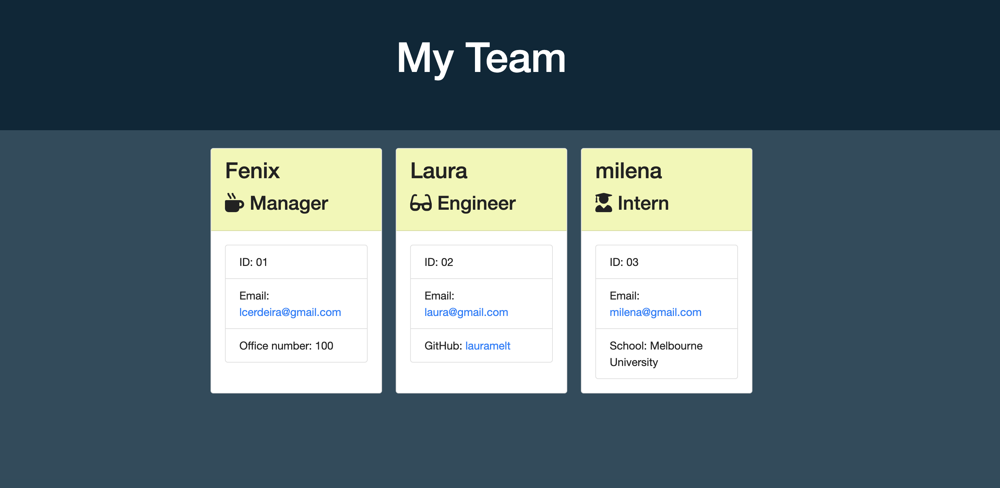

   
   
   
   
   
   
  

  # Welcome to Team Profile Generator


  ## Table of Contents

  * [Description](#Description)
  * [Demonstration](#Demonstration)
  * [Installation](#Installation)
  * [Usage](#Usage)
  * [License](#License)
  * [Contributions](#Contributions)
  * [Version](#Version)
  * [Tests](#Tests)
  * [Questions](#Questions)


  ## Description

  App generate a team web-page which will display each team member's role and contact information.

  ## Demonstration

  View a live demonstration [here](https://drive.google.com/file/d/1gjmVXO5TG8pm193CaAp-x-Zj9fBG8VgY/view?usp=sharing).

  #### A screenshot of the generated web page

  

  ## Installation

  Use git clone the repository. Run ```npm install``` inside ```Develop``` folder to install all required packages


  ## Usage

  Type ```node app.js```. Follows the instructions on the screen.


  ## License

  


  ## Contributions

  Contact me

  ## Version

  


  ## Tests

   ```npm run test``` inside ```develop``` directory.

  ## Questions

  please contact me via github or email:

  https://github.com/lcerdeira

  lcerdeira@gmail.com
